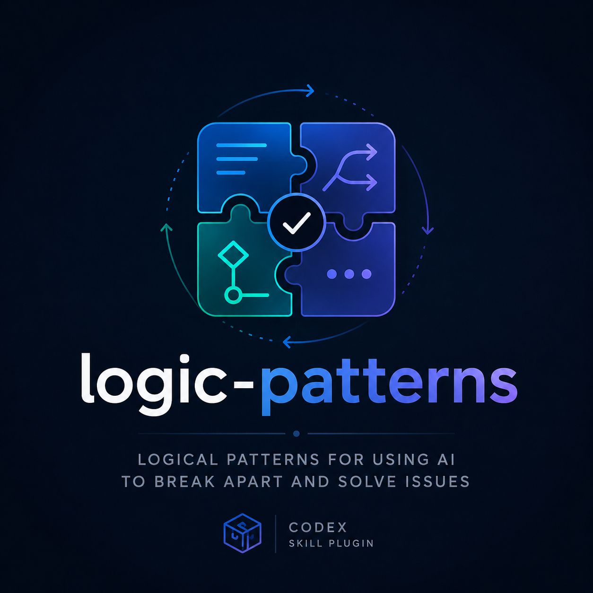

  

# logic-patterns

AI reasoning strategies used for structured problem solving and decision quality.

## Skills in this plugin

### 1-3-1
Use when uncertainty is high and speed plus correctness both matter. It forces three independent paths to be generated and compared before choosing one, which lowers anchoring bias and avoids committing too early. This is useful for rapid triage of fix strategy and for balancing simplicity against risk.

### adversary-loop
Use when a high-value correctness check is needed before and during implementation. It repeatedly subjects work to adversarial review focused on regressions, spec drift, and factual risk. This is useful for surfacing high-impact issues that a single pass might miss and for preserving correctness in complex changes.

### bifurcate
Use when multiple potential causes or factors interact and one path selection is needed. It repeatedly splits the problem space into two, explores the more promising path, and backtracks explicitly on failure. This is useful for keeping investigation organized and ensuring backtracking is explicit instead of random.

### first-principles-rebuild
Use when a system should be reimplemented from its fundamentals instead of incremental patching. It extracts core behavior from `SPEC.md`, strips non-essential assumptions, then merges only truly required implementation constraints before producing a reimplementation plan.

### gaslight-loop
Use when code is believed incomplete or subtly buggy and you want a quick local validation loop. It repeatedly asks for bug-finding and focused re-checking on a small surface until no significant findings remain. This is useful for tightening implementation quality before broader review or release gates.

### greyhat
Use when security, compliance, and abuse-resistance need explicit pressure testing before finishing work. It applies threat-model thinking in repeated passes, prioritizing high-confidence and high-impact risk before cosmetic cleanup. This is useful for avoiding late-stage security debt and preventing risky shortcuts from reaching implementation.

### make-a-plan
Use when initial plans are incomplete or under-scoped. It repeatedly asks for missing major details, then applies simplification passes without dropping required outcomes. This is useful for quickly converging on a plan that is both complete and practical.

### multidimensional-planning
Use when a problem has many independent planning axes and one-dimensional planning would miss dependencies. It asks dimension-by-dimension questions and updates the plan at each step, then resolves cross-dimension conflicts before coding. This is useful for building a robust, implementation-ready plan for new features or complex systems.
